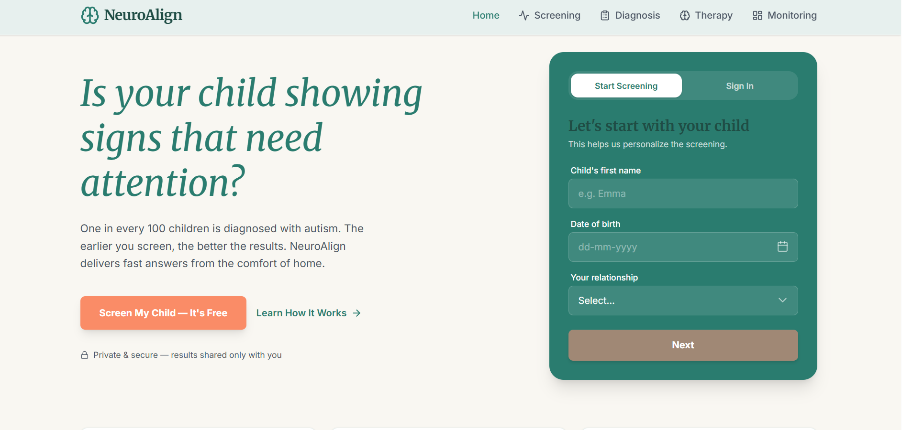
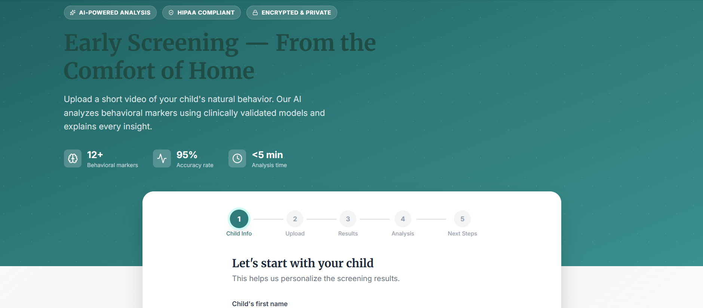
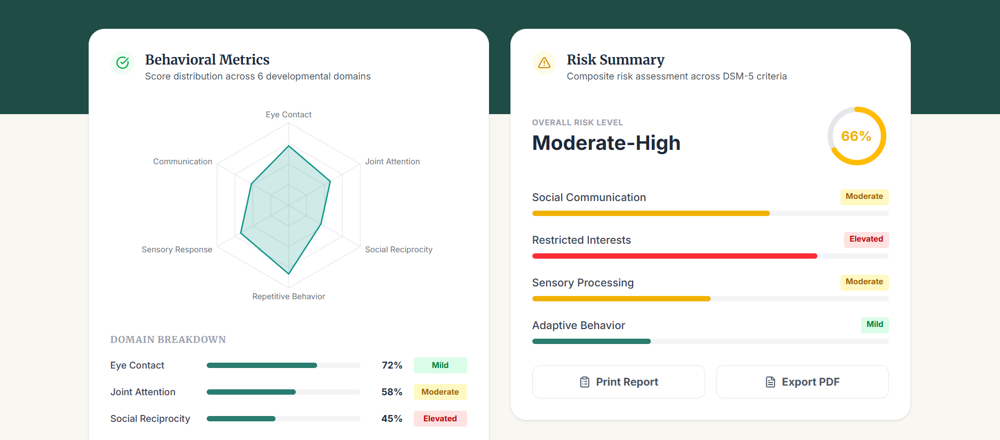
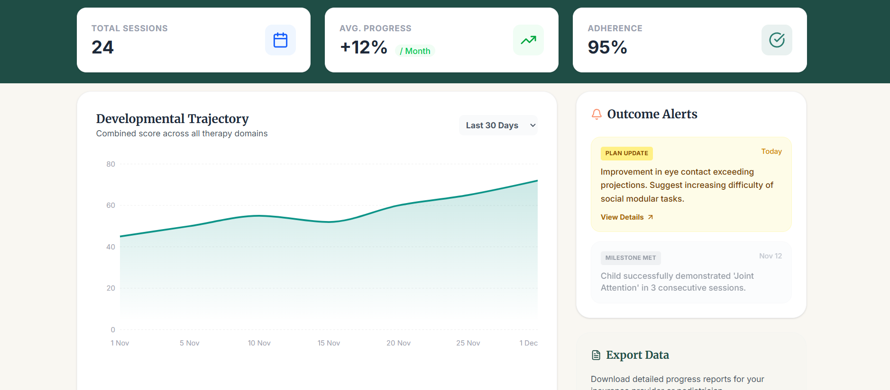
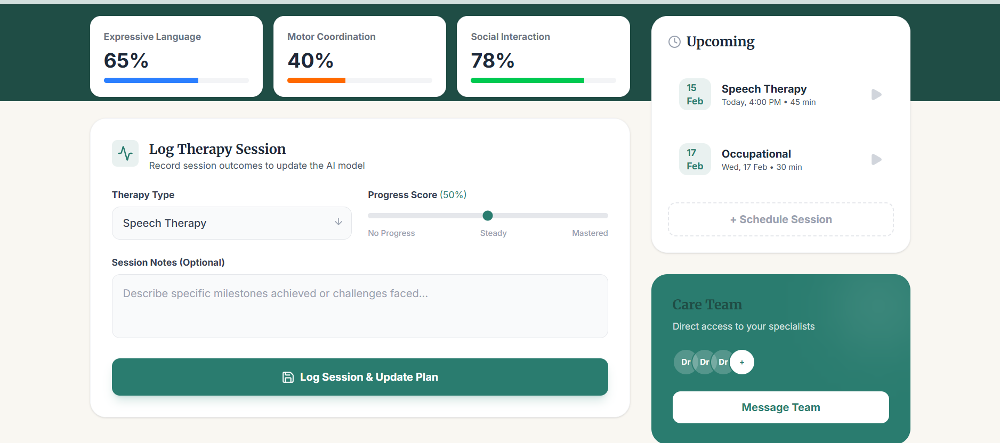

# 🧠 NeuroAlign

**AI-powered autism early detection and screening platform.**

NeuroAlign uses python technologies like OpenCV/Mediapipe  to analyze behavioral video data, provide risk scoring, SHAP explainability, and clinical recommendations — helping clinicians and parents get actionable insights faster.

---

## � Screenshots

### 🏠 Home Page


### 🔍 Screening


### 🩺 Diagnosis


### 📊 Monitoring


### 💊 Therapy


---

## �🗂️ Project Structure

```
NeuroAlign/
├── backend/          # Node.js + Express REST API
│   ├── routes/       # API route handlers (auth, screening, diagnosis, etc.)
│   ├── services/     # AI integration (Gemini)
│   ├── ml_service/   # Machine learning utilities
│   ├── models.js     # Sequelize ORM models (SQLite)
│   └── server.js     # Entry point
├── frontend/         # React + Vite SPA
│   ├── src/
│   │   ├── pages/    # Page components (Screening, Analysis, etc.)
│   │   └── ...
│   └── index.html
├── scripts/          # Utility / helper scripts
└── vercel.json       # Vercel deployment config
```

---

## 🚀 Getting Started


### 1. Clone the repository

```bash
git clone https://github.com/alreadymessedup/NeuroAlign.git
cd NeuroAlign
```

### 2. Set up the Backend

```bash
cd backend
npm install
```


Start the backend server:

```bash
npm run dev       # Development (nodemon)
# or
npm start         # Production
```

The backend runs on **http://localhost:5000** by default.

### 3. Set up the Frontend

```bash
cd frontend
npm install
npm run dev
```

The frontend runs on **http://localhost:5173** by default.

---

## 🛠️ Tech Stack

| Layer     | Technology                              |
|-----------|-----------------------------------------|
| Frontend  | React 19, Vite, React Router, Recharts  |
| Backend   | Node.js, Express 5, Sequelize, SQLite   |
| AI        | OpenCV/Mediapipe,Scikit-learn,Shap,Numpy,Torch,Torchvision|
| Auth      | JWT + bcryptjs                          |
| Uploads   | Multer                                  |
| Deployment| Vercel (frontend), configurable backend |

---

## 🌐 Deployment

The project is configured for **Vercel** deployment of the frontend:

```json
// vercel.json
{
  "buildCommand": "cd frontend && npm install && npm run build",
  "outputDirectory": "frontend/dist"
}
```


---

